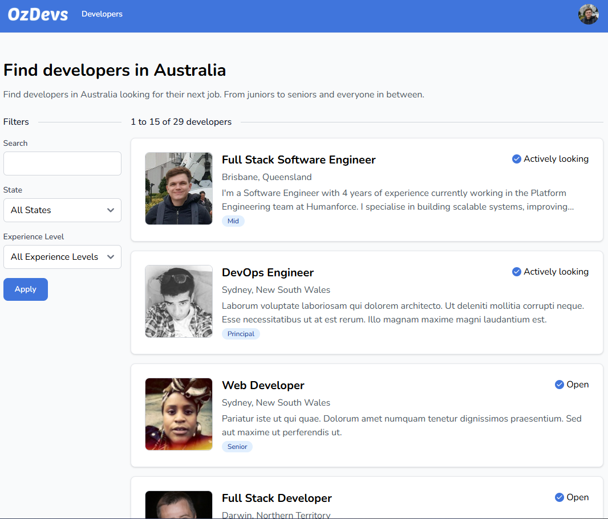
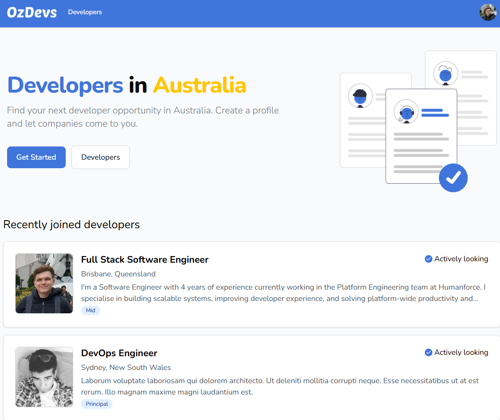
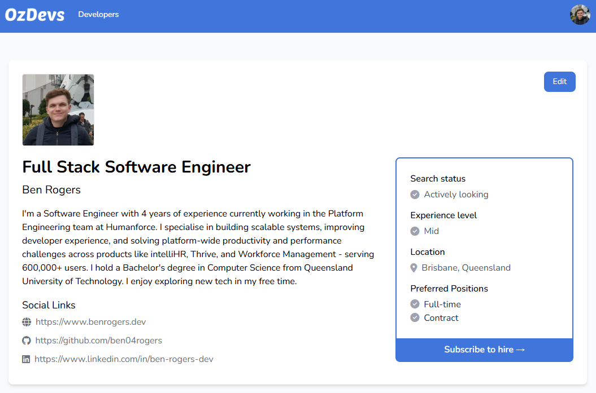
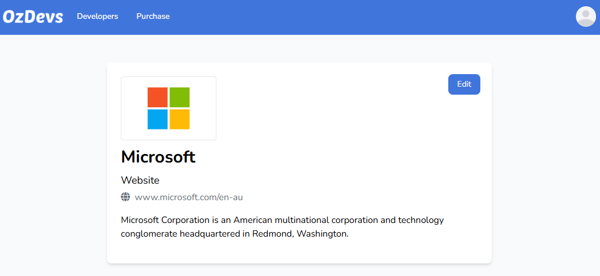
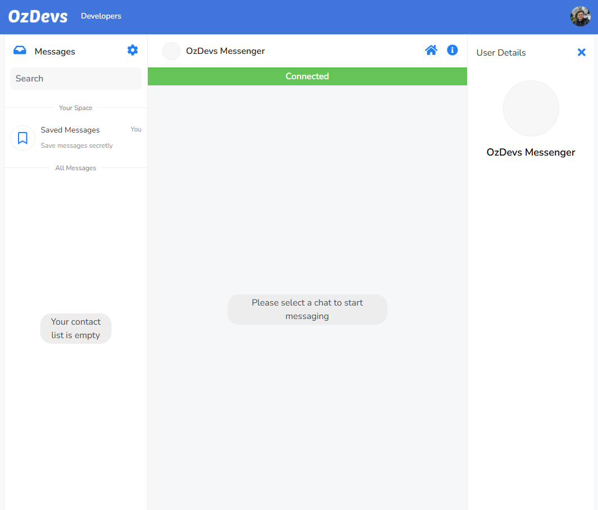
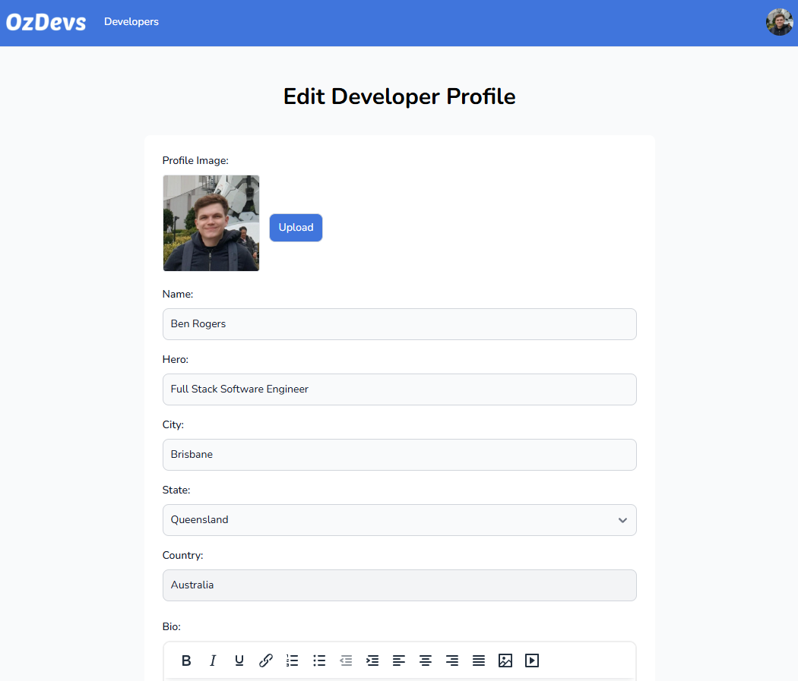
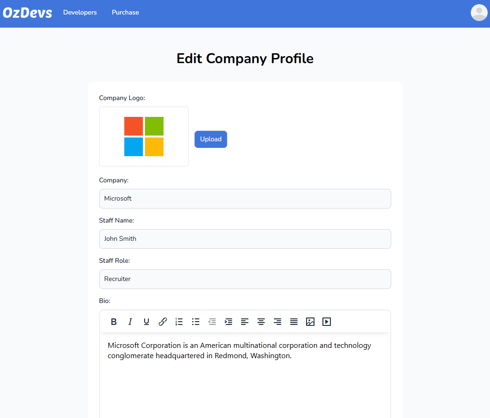
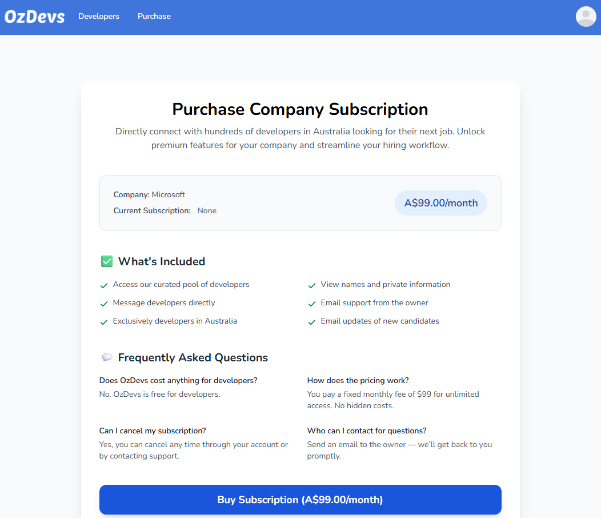

# Developer Job Matching Portal

OzDevs is a reverse job board for developers in Australia! This platform is designed to help software developers find jobs in the tech industry across Australia.





[See more images here](#screenshots)


## Features

- Developer Profiles: Create detailed developer profiles with your location, bio, skills, experience, and contact information
- Messaging System: Communicate with potential employers within the platform.
- Search Profiles: Filter developer profiles by keywords, state, and experience level.

## Getting Started

### Installation

1. Clone this repository to your local machine:

```sh
git clone https://github.com/your-repo-name.git
```

2. Install project dependencies using Composer and NPM:

```
composer install
npm install
```

3. Create a copy of the .env.example file and name it .env:

```
cp .env.example .env
```

4. Generate a unique application key:

```
php artisan key:generate
```

5. Update the .env file with your database configuration. Set the DB_DATABASE, DB_USERNAME, and DB_PASSWORD to match your local database setup.

6. Run database migrations to create the necessary tables:

```
php artisan migrate
```

7. Seed database with some test data:

```
php artisan db:seed
```

### Running locally

1. Run the Laravel app

```
php artisan serve
```

2. Compile and bundle front end assets

```
npm run dev
```

---

## Testing Stripe Webhooks Locally

Stripe webhooks are crucial for handling subscription events (such as cancellations, renewals, payment failures, etc.) in development. Stripe provides a CLI tool to make this process easy.

### Step 1: Install Stripe CLI

Follow the [Stripe CLI installation guide](https://stripe.com/docs/stripe-cli#install) to install the CLI on your system.

For example, on macOS:
```sh
brew install stripe/stripe-cli/stripe
```
On Ubuntu:
```sh
curl -sS https://stripe-cli.com/install.sh | bash
```

### Step 2: Authenticate Stripe CLI

Log in with your Stripe account:
```sh
stripe login
```
This will prompt you with a pairing code and open your browser to confirm authentication.

### Step 3: Listen for Webhooks

Forward Stripe webhook events to your local Laravel endpoint:
```sh
stripe listen --forward-to localhost:8000/stripe/webhook
```
You will see output like:
```
Ready! You are using Stripe API Version [2020-08-27]. Your webhook signing secret is whsec_xxx...
```

### Step 4: Trigger Events (e.g. Cancellations)

You can manually trigger events using the Stripe dashboard or Stripe CLI.
For cancellations, go to the [Stripe Dashboard](https://dashboard.stripe.com/test/customers), find your test customer, and cancel their subscription.

You can also trigger test events from the CLI:
```sh
stripe trigger customer.subscription.deleted
stripe trigger customer.subscription.updated
```

#### **Common Webhook Events to Test**
- `customer.subscription.created` — When a new subscription starts
- `customer.subscription.updated` — When a subscription is changed or canceled
- `customer.subscription.deleted` — When a subscription ends/cancels
- `invoice.payment_succeeded` — When a payment succeeds
- `invoice.payment_failed` — When a payment fails

### Troubleshooting

- If you get a 419 error, make sure `/stripe/webhook` is excluded from CSRF protection in your `VerifyCsrfToken` middleware.
- Always restart your Stripe CLI session if you restart the Laravel server.

---

## Additional Notes

- Stripe CLI is only for local development; for production, Stripe will send webhooks directly to your deployed `/stripe/webhook` endpoint.
- You can find more info in the [Stripe Webhooks documentation](https://stripe.com/docs/webhooks).

## Screenshots

> A quick tour of the main pages. Images are stored in `docs/screenshots/`.

<table>
  <tr>
    <td align="center" valign="top" width="50%">
      
      <div><sub><b>Home</b> — Landing with CTA and recent developers</sub></div>
    </td>
    <td align="center" valign="top" width="50%">
      
      <div><sub><b>Developers</b> — Searchable, filterable list of profiles</sub></div>
    </td>
  </tr>
  <tr>
    <td align="center" valign="top" width="50%">
      
      <div><sub><b>Developer Profile</b> — Bio, skills, experience, contact</sub></div>
    </td>
    <td align="center" valign="top" width="50%">
      
      <div><sub><b>Company Profile</b> — Company presence shown during outreach</sub></div>
    </td>
  </tr>
  <tr>
    <td align="center" valign="top" width="50%">
      
      <div><sub><b>Messages</b> — Built-in messaging between companies and developers</sub></div>
    </td>
    <td align="center" valign="top" width="50%">
      
      <div><sub><b>Edit Developer Profile</b> — Update profile information and media</sub></div>
    </td>
  </tr>
  <tr>
    <td align="center" valign="top" width="50%">
      
      <div><sub><b>Edit Company Profile</b> — Update organization details</sub></div>
    </td>
    <td align="center" valign="top" width="50%">
      
      <div><sub><b>Purchase</b> — Subscribe to enable messaging and outreach</sub></div>
    </td>
  </tr>
</table>
